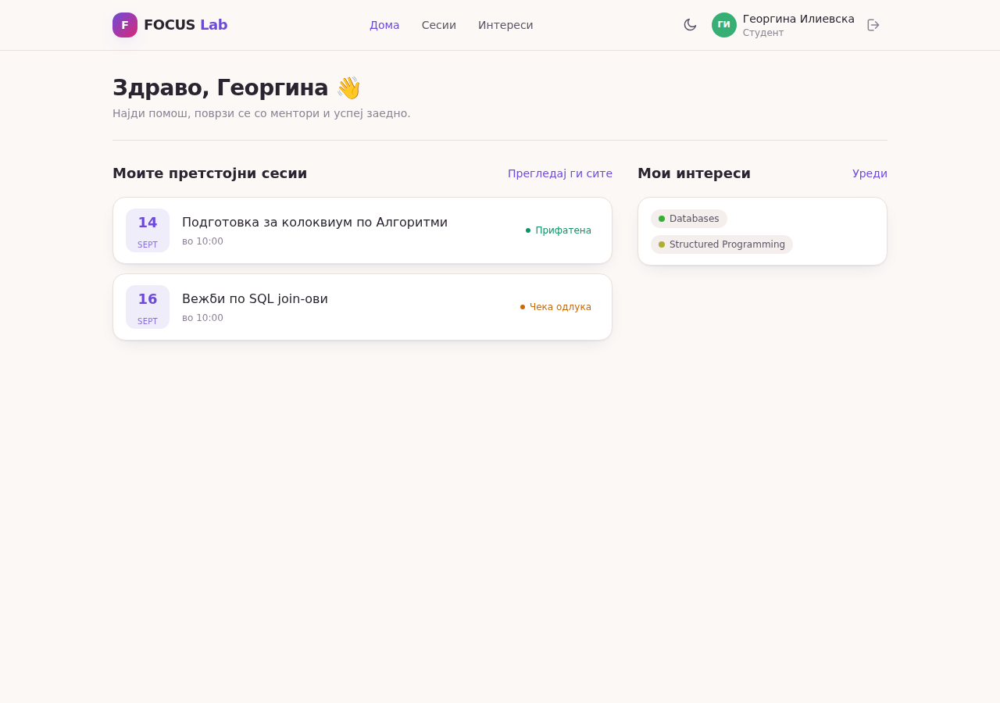
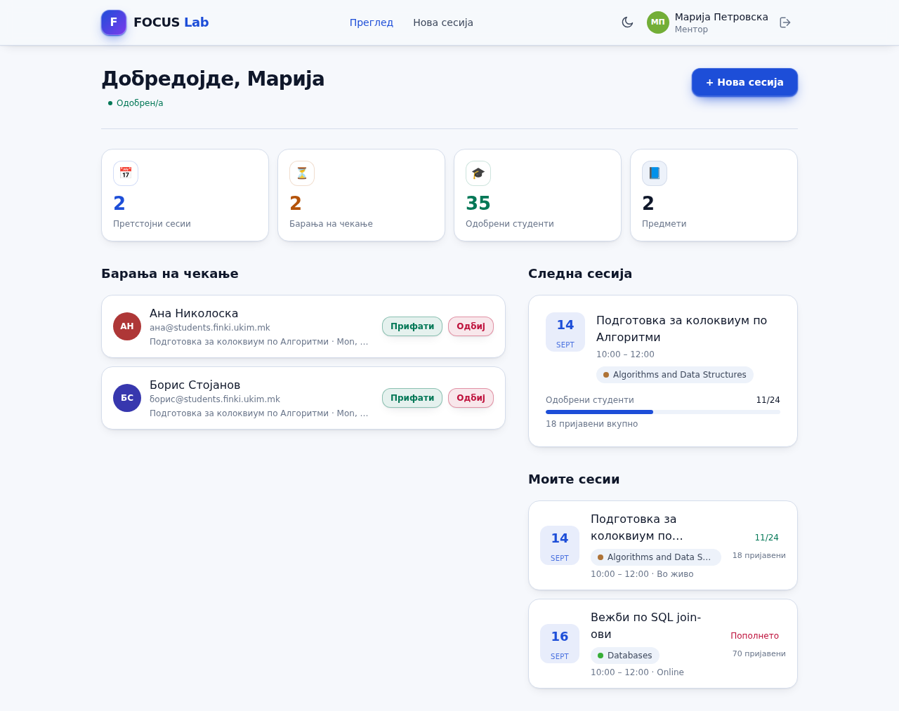
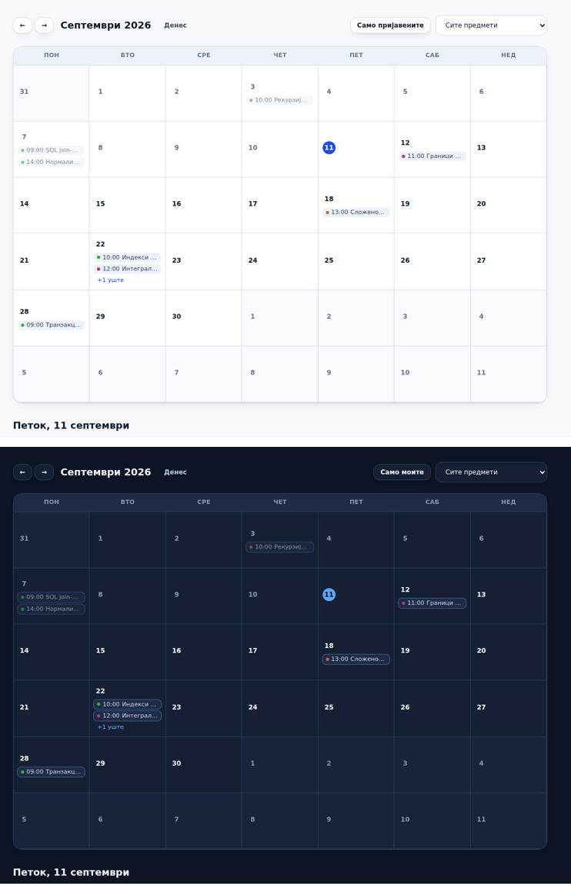
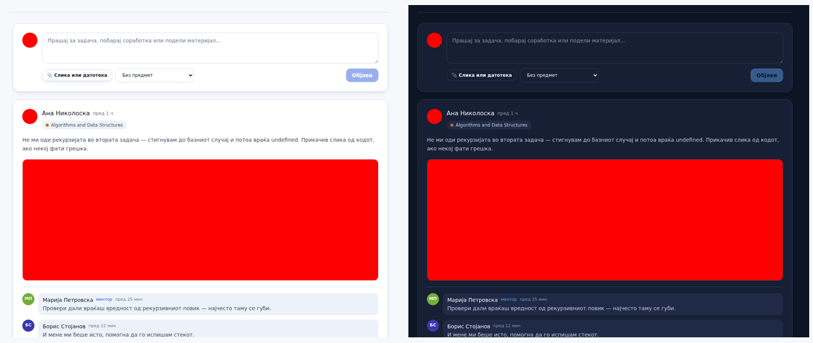
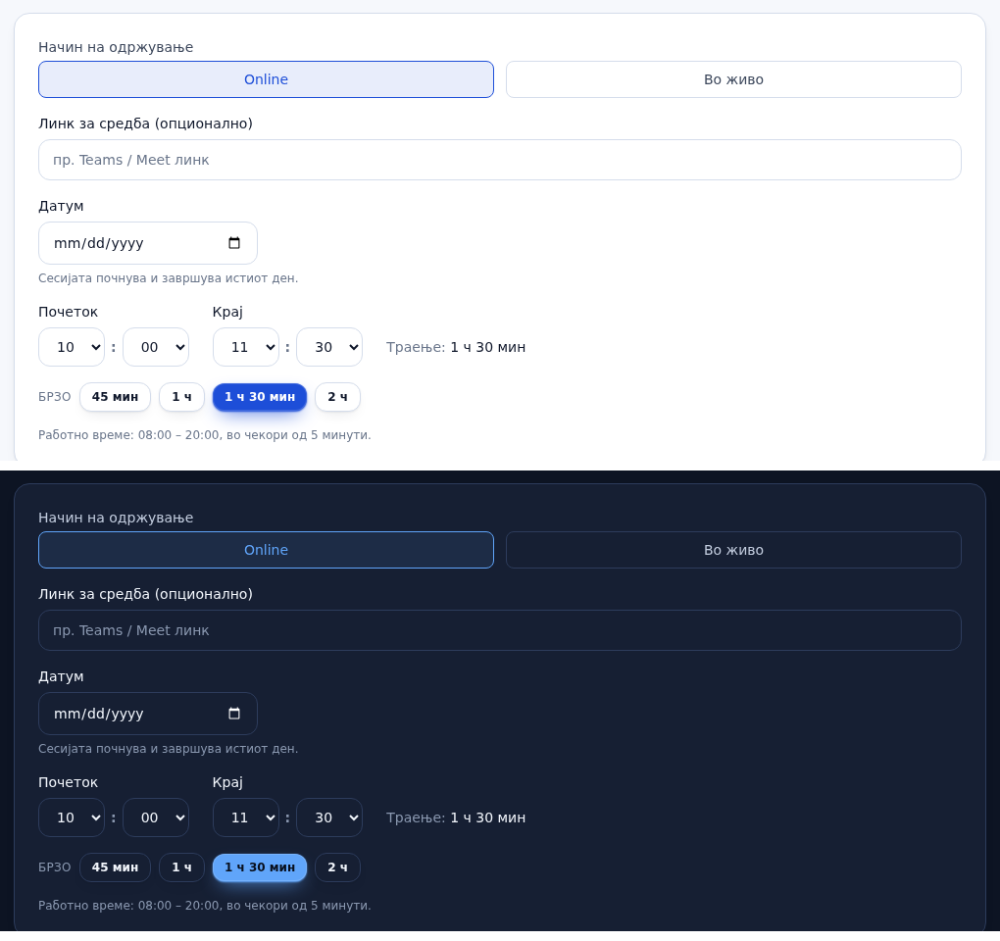
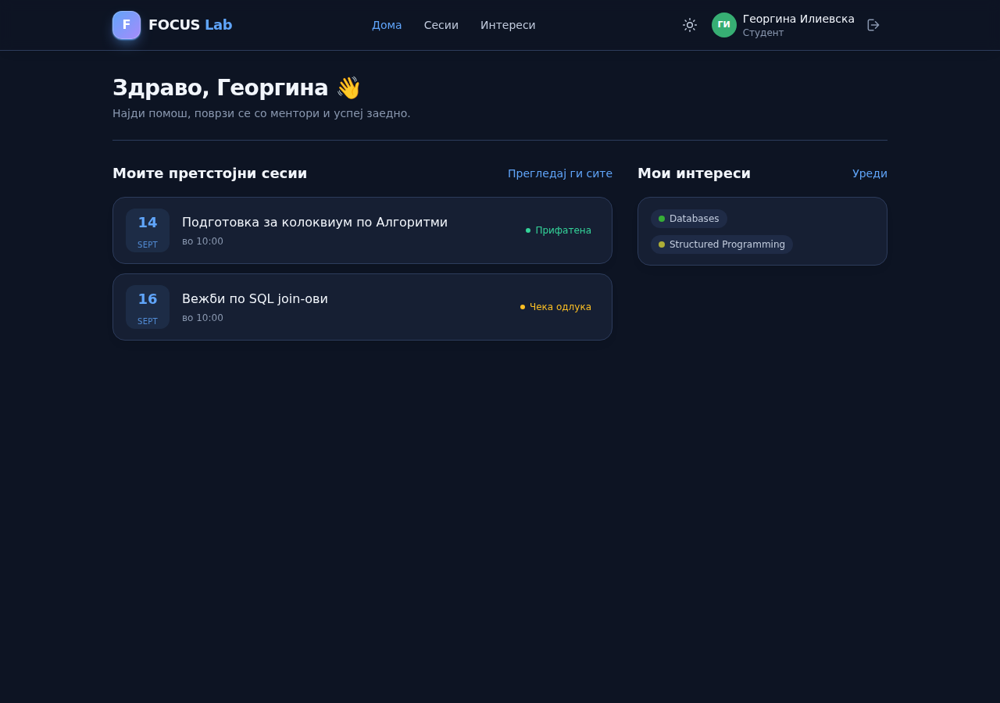

# FOCUS Lab

Платформа за менторски сесии: студентите се пријавуваат на сесии по предмет, менторите
одлучуваат кој е примен, админот ги одобрува менторите и ги води предметите.

**Stack:** Spring Boot 3.3 · Java 21 · PostgreSQL 16 · React 18 · TypeScript · Vite · Tailwind

---

## Функционалности

* Регистрација само со факултетски email; JWT автентикација; три улоги — студент, ментор, админ
* Ментор закажува сесија по предмет (со ко-ментор, онлајн или во просторија), ја уредува и откажува
* Студент се пријавува; менторот прифаќа или одбива; лимит на пријавени и на одобрени
* Календар со сите сесии по денови
* Забелешки за сесија што ги гледаат само менторите — секој пишува свои, ги чита на сите
* Постови: текст, прилози и коментари — за прашања околу задачи и договарање заедничка работа
* Профил со слика, интереси по предмет и заборавена лозинка
* Известувања по email за нова сесија, пријава, одлука, измена, откажување и дневен потсетник
* Светла и темна тема; интерфејсот е целосно на македонски

---

## Слики

| Дома (студент) | Преглед (ментор) |
| --- | --- |
|  |  |

| Календар | Постови |
| --- | --- |
|  |  |

| Закажување | Темна тема |
| --- | --- |
|  |  |

---

## Стартување

Потребно: Java 21, Maven, Node 20+, PostgreSQL 16.

```bash
# 1. база
createdb focuslab && createuser focuslab

# 2. backend (терминал 1)
cd backend && mvn spring-boot:run                   # http://localhost:8080

# 3. frontend (терминал 2)
cd frontend && npm install && npm run dev           # http://localhost:5173
```

Vite го proxy-ира `/api` кон `localhost:8080`.

### Со Docker

```bash
cp .env.example .env      # пополни JWT_SECRET и ADMIN_PASSWORD
docker compose up --build
```

### Admin сметка

Се создава автоматски при прво стартување, од `ADMIN_EMAIL` / `ADMIN_PASSWORD`.
Само преку неа се одобрува ментор — новорегистриран ментор е `PENDING` и не може
да закажува сесии.

---

## Тестови

```bash
cd backend && mvn test          # деловни правила, домени, интереси, профил, лозинки
cd frontend && npm run build    # type check + production build
```

### Email локално

Без вистински SMTP известувањата само се логираат. За да се видат пораките:

```bash
docker run -d --name mailpit -p 1025:1025 -p 8025:8025 axllent/mailpit

cd backend
MAIL_HOST=localhost MAIL_PORT=1025 MAIL_AUTH=false MAIL_STARTTLS=false mvn spring-boot:run
```

Сите пораки се појавуваат на `http://localhost:8025`.

---

## Конфигурација

Сите чувствителни вредности се читаат од околина преку `.env`, кој не е во репото.
`.env.example` покажува што се пополнува. Пред deploy задолжително се менуваат
`JWT_SECRET`, `ADMIN_PASSWORD`, `DB_PASSWORD` и `MAIL_*`.

| Променлива | Значење |
|---|---|
| `DB_NAME` / `DB_USER` / `DB_PASSWORD` | Postgres |
| `JWT_SECRET` / `JWT_EXPIRATION_MS` | потпис и рок на токенот |
| `MAIL_USERNAME` / `MAIL_PASSWORD` / `MAIL_FROM` | SMTP сметка |
| `ADMIN_EMAIL` / `ADMIN_PASSWORD` | админ сметката |
| `ALLOWED_EMAIL_DOMAINS` | домени дозволени при регистрација |
| `FRONTEND_ORIGIN` | CORS и основа за линковите во email |

---

## Структура

### Backend — `backend/src/main/java/mk/focuslab`

| Пакет | Содржина |
|---|---|
| `model` | JPA ентитети, enum-и и `BusinessRules` со лимитите |
| `repository` | Spring Data JPA репозиториуми |
| `dto` | Java records за вход и излез на API-то |
| `mapper` | `DtoMapper` — ентитет во DTO |
| `service` | деловна логика |
| `event` | настани што `EmailService` ги слуша по комит на транзакцијата |
| `controller` | REST endpoints |
| `security` | JWT филтер, `UserPrincipal`, `CustomUserDetailsService` |
| `exception` | сопствени исклучоци и `GlobalExceptionHandler` |
| `config` | `SecurityConfig`, `AdminSeeder` |

### Frontend — `frontend/src`

| Папка | Содржина |
|---|---|
| `types` | огледало на backend DTO-ата |
| `api` | обвивки околу axios; `client.ts` го додава токенот |
| `lib` | датуми, грешки, рути, ознаки, бои, календар, распоред |
| `hooks` | `useAsync` |
| `components/ui` | `Card`, `Button`, `Badge`, `Alert`, `Field`, `EmptyState`, `Skeleton`, `StatCard`, `PageHeader` |
| `components` | `Layout`, `Navbar`, `SessionCard`, `PostCard`, `Avatar`, `BrandMark`, `SchedulePicker` |
| `context` | `AuthContext` и `ThemeContext` |
| `pages` | екраните по улога |

Боите се CSS променливи во `index.css` со семантички имена во `tailwind.config.js`
(`bg-surface`, `text-ink`, `bg-brand`), па една класа работи во двете теми.

Логото се чува како растер во неколку големини. Мастер сликата и скриптата се во
`brand/`:

```bash
cd brand && pip install pillow && python3 prepare-logo.py
```

---

## Деловни правила

1. Менторот мора да е одобрен пред да може да закажува сесии; истото важи за ко-ментор.
2. Сесија има најмногу 2 ментори, 70 пријавени и 24 одобрени студенти (`BusinessRules`).
3. Сесијата е во еден ден, во работно време 08:00 – 20:00, во чекори од 5 минути.
4. Пријавувањето и одлуката земаат `PESSIMISTIC_WRITE` lock на сесијата.
5. Студентот го гледа само бројот на одобрени, не и на пријавени.
6. Сесија уредува и откажува само ментор на таа сесија.
7. Email известувањата се праќаат по комит на транзакцијата и носат готови вредности.

### Известувања по email

| Кога | Кому |
|---|---|
| Нова сесија по предмет од интерес | студентите со тој интерес |
| Примена пријава | студентот |
| Прифатена или одбиена пријава | студентот |
| Изменета сесија | пријавените |
| Откажана сесија | пријавените |
| Промена на лозинка | корисникот |
| Дневен потсетник 08:00 | прифатените за денешните сесии |

Известување за измена одат само промените што го менуваат договорот со студентот —
време, место, начин, наслов, предмет.

### Прилози во постовите

Најмногу 4 датотеки по 5 MB. Дозволени се слики, PDF, текст, ZIP и Office формати;
сликите се декодираат за да се потврди типот, SVG и HTML не се дозволени, а сè што не
е слика се служи со `Content-Disposition: attachment`. Правилата се во `FeedService`
и важат за секое барање, не само за формата.
